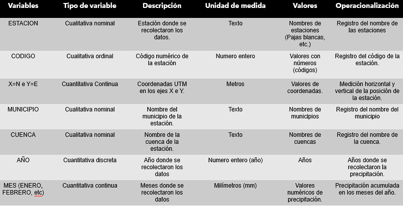
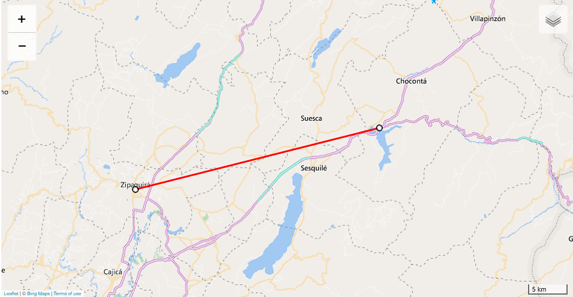
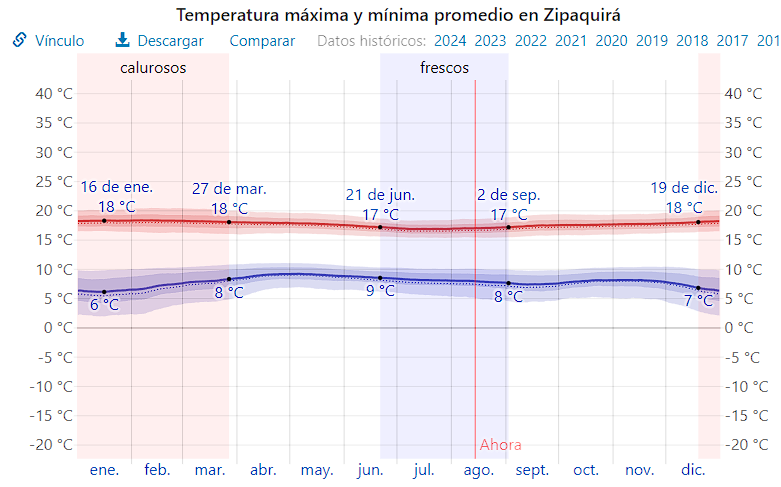
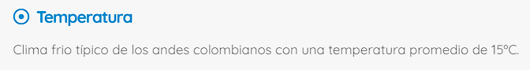

```{r setup, include=FALSE}
knitr::opts_chunk$set(echo = TRUE)
```

## Precipitacion Mensual en Cundinamarca

Por: Juan Camilo Aguirre

Metodos Estadisticos

Agosto 14, 2024

## Introduccion

En esta presentacion, se mostrara el analisis comprensivo de la base de datos: *Precipitaciones Totales Mensuales.*

Volumen de precipitaciones mensuales obtenido en la red de estaciones hidrológicas de la Corporación Autónoma Regional de Cundinamarca - CAR.

Esta trae informacion sobre precipitaciones en el departamento de Cundinamarca desde 1920 hasta 2019.

Las dimensiones son de 6,196 (filas) x 19 (columnas) = 117,724 datos.

## Objetivos de la presentacion

(1. ¿Qué objetivo plantearías para el estudio o el interés del investigador? )

-   Realizar un analisis descriptivo sobre los datos climatologicos.
-   Estalecer tendencias sobre los diversos meses y su respectiva precipitacion.

Para la presentacion, se utilizaron las siguientes librerias como herramientas para manipular y organizar los datos:

```{r library}
library(readxl)
library(viridis)
library(ggplot2)
#library(sf)
#library(ggspatial)
library(tidyr)
library(dplyr)
library(pastecs)
library(patchwork)
library(leaflet)
#library(summarytools)
#library(pandoc)
library(knitr)
```

Con esto en mente, podemos proceder con la siguiente parte de la presentacion.

## Cuadro operacional de variables

(2.¿Qué variables se involucran en el estudio y de qué tipo son? Cuadro de operacionalización de variables)



Figura 1. Cuadro operacional de variables.

## Pre-Analisis descriptivo

```{r}
#Primero se carga la base de datos
precipitaciones <- read_excel("C:\\Users\\Administrador\\Documents\\R\\precipitaciones\\precipitaciones.xlsx")

head(precipitaciones)
```

## Analisis descriptivo

(3. Realice un descriptivo de los datos, incluya gráficos y resúmenes numéricos. )

```{r}
hist(precipitaciones$AÑO, breaks=75, 
     main="Histograma de Precipitaciones", 
     xlab="Año", 
     ylab="Frecuencia",
     sub="Figura 2. Histograma de frecuencias de registros de precipitaciones.")

```

Para encontrar resultados numericos enfocados en los datos importantes, creamos un nuevo dataset con solo los meses:

```{r}
meses <- precipitaciones %>% select(ENERO:DICIEMBRE)
```

Aqui se sacaran dos diferentes metodos para obtener resultados numericos:

### Metodo 1: summary()

```{r}
summary(meses)
```

### Metodo 2: stat.desc() (usando la libreria pastecs)

```{r}
stat.desc(meses)

```

Adicionalmente, se filtraran la cantidad de registros por estacion.

```{r}
station_count <- precipitaciones %>%
  group_by(ESTACIÓN) %>%
  summarize(Conteo = n(), .groups = 'drop') %>%
  arrange(ESTACIÓN)  

print(station_count)
```

De forma general, los promedios de precipitacion para cada mes se observa en las siguientes graficas:

```{r}
monthly_averages <- precipitaciones %>%
  summarise(
    ENERO = mean(ENERO, na.rm = TRUE),
    FEBRERO = mean(FEBRERO, na.rm = TRUE),
    MARZO = mean(MARZO, na.rm = TRUE),
    ABRIL = mean(ABRIL, na.rm = TRUE),
    MAYO = mean(MAYO, na.rm = TRUE),
    JUNIO = mean(JUNIO, na.rm = TRUE),
    JULIO = mean(JULIO, na.rm = TRUE),
    AGOSTO = mean(AGOSTO, na.rm = TRUE),
    SEPTIEMBRE = mean(SEPTIEMBRE, na.rm = TRUE),
    OCTUBRE = mean(OCTUBRE, na.rm = TRUE),
    NOVIEMBRE = mean(NOVIEMBRE, na.rm = TRUE),
    DICIEMBRE = mean(DICIEMBRE, na.rm = TRUE)
  )

monthly_averages_long <- monthly_averages %>%
  pivot_longer(cols = everything(), names_to = "Mes", values_to = "Promedio")

monthly_averages_long$Mes <- factor(monthly_averages_long$Mes, levels = c("ENERO", "FEBRERO", "MARZO", "ABRIL", "MAYO", "JUNIO", "JULIO", "AGOSTO", "SEPTIEMBRE", "OCTUBRE", "NOVIEMBRE", "DICIEMBRE"))

```

```{r}
ggplot(monthly_averages_long, aes(x = Mes, y = Promedio, fill = Promedio)) +
  geom_bar(stat = "identity") +
  scale_fill_viridis_c(option = "viridis") +  
  labs(title = "Promedio de Precipitaciones Mensuales",
       y = "mm",
      caption="Figura 3. Grafica de barras del promedio de precipitacion (mensual)"
) +
  theme_minimal() +
  theme(axis.text.x = element_text(angle = 45, hjust = 1),
        plot.caption = element_text(hjust = 0.5))  
```

```{r}

precipitaciones_long <- precipitaciones%>%
  pivot_longer(
    cols = ENERO:DICIEMBRE,
    names_to = "Mes",
    values_to = "Precipitacion"
  )

precipitaciones_long$Mes <- factor(precipitaciones_long$Mes, levels = c("ENERO", "FEBRERO", "MARZO", "ABRIL", "MAYO", "JUNIO", "JULIO", "AGOSTO", "SEPTIEMBRE", "OCTUBRE", "NOVIEMBRE", "DICIEMBRE"))

ggplot(precipitaciones_long, aes(x = Mes, y = Precipitacion, fill = Mes)) +
  geom_boxplot() +  
  scale_fill_viridis_d(option = "viridis") +
  labs(title = "Distribución Mensual de Precipitaciones",
       x = "Mes",
       y = "Precipitación",
       caption="Figura 4. Boxplot del promedio de precipitacion (mensual)") +
  theme_minimal() +
  theme(axis.text.x = element_text(angle = 45, hjust = 1),
        plot.caption = element_text(hjust = 0.5))  
```

A continuacion, se mostraran los años con menor y mayor precipitacion, en dicho orden.

```{r}
total_precipitation_by_year <- precipitaciones %>%
  group_by(AÑO) %>%
  summarise(TotalPrecipitacion = sum(c_across(ENERO:DICIEMBRE), na.rm = TRUE)) %>%
  arrange(desc(TotalPrecipitacion))

top10_years <- total_precipitation_by_year %>%
  slice_max(TotalPrecipitacion, n = 10)

bottom10_years <- total_precipitation_by_year %>%
  slice_min(TotalPrecipitacion, n = 10)
```

### Mayor precipitacion

```{r}
ggplot(top10_years, aes(x = reorder(factor(AÑO), TotalPrecipitacion), y = TotalPrecipitacion, fill = TotalPrecipitacion)) +
  geom_bar(stat = "identity") +
  scale_fill_viridis_c(option = "viridis", direction = -1) +
  labs(title = "Top 10 Años con Mayor Precipitación" ,
       x = "Año",
       y = "Total de Precipitaciones (mm)",
      caption="Figura 5. Grafico de los 10 años con mayor precipitacion") +
  theme_minimal() +
  theme(axis.text.x = element_text(angle = 45, hjust = 1),
        plot.caption = element_text(hjust = 0.5))
```

### Menor precipitacion

```{r}
ggplot(bottom10_years, aes(x = reorder(factor(AÑO), TotalPrecipitacion), y = TotalPrecipitacion, fill = TotalPrecipitacion)) +
  geom_bar(stat = "identity") +
  scale_fill_viridis_c(option = "viridis", direction = -1) +
  labs(title = "Top 10 Años con Menor Precipitación",
       x = "Año",
       y = "Total de Precipitaciones (mm)",
        caption="Figura 6. Grafico de los 10 años con menor precipitacion") +
  theme_minimal() +
  theme(axis.text.x = element_text(angle = 45, hjust = 1),
        plot.caption = element_text(hjust = 0.5))  
```

Junto a estos, tambien se mostrara la proporcion del promedio de precipitacion por mes

```{r}
long_data <- precipitaciones %>%
  pivot_longer(cols = ENERO:DICIEMBRE, names_to = "Mes", values_to = "Precipitacion")

total_precipitation_by_month <- long_data %>%
  group_by(Mes) %>%
  summarise(TotalPrecipitacion = sum(Precipitacion, na.rm = TRUE)) %>%
  arrange(desc(TotalPrecipitacion))
```

### Meses segun su precipitacion total

```{r}
ggplot(total_precipitation_by_month, aes(x = reorder(Mes, -TotalPrecipitacion), y = TotalPrecipitacion, fill = TotalPrecipitacion)) +
  geom_bar(stat = "identity") +
  scale_fill_viridis_c(option = "viridis", direction = 1) +
  labs(title = "Precipitación Total por Mes",
       x = "Mes",
       y = "Total de Precipitaciones (mm)",
      caption="Figura 7. Grafico de los meses del año segun su precipitacion total.") +
  theme_minimal() +
  theme(axis.text.x = element_text(angle = 45, hjust = 1),
        plot.caption = element_text(hjust = 0.5)) 
```

## Analisis detallado

(4 .Inspeccione un histograma y/o un diagrama de caja y bigotes con los datos de tipo numérico. A partir de su inspección, ¿cómo podría definir esta distribución, con asimetría positiva, con asimetría negativa o simétrica? ¿Se ajustan estos datos a una distribución normal? )

Para este punto, se eligio la precipitacion de la cual se tienen registros historicos en la estacion por el lago Guatavita. Este representa una gran importancia por su conexion al embalse de Tominé, uno de los embalses mas importantes para la capital.

```{r}
guatavita_data <- precipitaciones %>%
  filter(ESTACIÓN == "Guatavita")

monthly_averages <- guatavita_data %>%
  summarise(
    ENERO = mean(ENERO, na.rm = TRUE),
    FEBRERO = mean(FEBRERO, na.rm = TRUE),
    MARZO = mean(MARZO, na.rm = TRUE),
    ABRIL = mean(ABRIL, na.rm = TRUE),
    MAYO = mean(MAYO, na.rm = TRUE),
    JUNIO = mean(JUNIO, na.rm = TRUE),
    JULIO = mean(JULIO, na.rm = TRUE),
    AGOSTO = mean(AGOSTO, na.rm = TRUE),
    SEPTIEMBRE = mean(SEPTIEMBRE, na.rm = TRUE),
    OCTUBRE = mean(OCTUBRE, na.rm = TRUE),
    NOVIEMBRE = mean(NOVIEMBRE, na.rm = TRUE),
    DICIEMBRE = mean(DICIEMBRE, na.rm = TRUE)
  )

monthly_averages_long <- monthly_averages %>%
  pivot_longer(cols = everything(), names_to = "Mes", values_to = "Promedio")


monthly_averages_long$Mes <- factor(monthly_averages_long$Mes, levels = c("ENERO", "FEBRERO", "MARZO", "ABRIL", "MAYO", "JUNIO", "JULIO", "AGOSTO", "SEPTIEMBRE", "OCTUBRE", "NOVIEMBRE", "DICIEMBRE"))

ggplot(monthly_averages_long, aes(x = Mes, y = Promedio, fill = Promedio)) +
  geom_bar(stat = "identity") +
  scale_fill_viridis_c(option = "viridis") +  
  labs(title = "Promedio de Precipitaciones Mensuales en Guatavita",
       x = "Mes",
       y = "Promedio de Precipitaciones",
caption = "Figura 8. Promedio de precipitacion mensual en Guatavita") +
  theme_minimal() +
  theme(axis.text.x = element_text(angle = 45, hjust = 1),
        plot.caption = element_text(hjust = 0.5))  


guatavita_long <- guatavita_data %>%
  pivot_longer(
    cols = ENERO:DICIEMBRE,
    names_to = "Mes",
    values_to = "Precipitacion"
  )
```

```{r}
guatavita_long$Mes <- factor(guatavita_long$Mes, levels = c("ENERO", "FEBRERO", "MARZO", "ABRIL", "MAYO", "JUNIO", "JULIO", "AGOSTO", "SEPTIEMBRE", "OCTUBRE", "NOVIEMBRE", "DICIEMBRE"))

ggplot(guatavita_long, aes(x = Mes, y = Precipitacion, fill = Mes)) +
  geom_boxplot() +  
    scale_fill_viridis_d(option = "viridis") +  
  labs(title = "Distribución Mensual de Precipitaciones en Guatavita",
       x = "Mes",
       y = "Precipitación",
  caption = "Figura 9. Boxplot de precipitacion mensual en Guatavita") +

  theme_minimal() +
  theme(axis.text.x = element_text(angle = 45, hjust = 1),
        plot.caption = element_text(hjust = 0.5))  

```

De aqui podemos sacar las siguientes conclusiones:

Los datos que representan la precipitacion en la estacion Guatavita:

-   Tienen una distribucion bimodal presentes en Abril y Octubre
-   No presenta una simetria, presenta una ligera asimetria
-   Presenta una curtosis Mesocurtica

## Grupos de interes

(5. Seleccione dos o más grupos de interés ¿Existen diferencias estadísticamente significativas entre los valores medios de los grupos involucrados? )

Para este item, se eligieron dos estaciones con altos numeros de reporte (de ahi la importancia de filtrar por nombre y cantidad).

En esta instancia se escogieron las estaciones ubicadas en la represas de Sisga y Zipaquirá








----------------------------------------------------------------------------------------------------------------------------------

Para empezar, observaremos de manera grafica ambass estaciones

### Lluvia promedia en la estacion Zipaquira vs Lluvia promedia en la represa Sisga

```{r}
month_levels <- c("ENERO", "FEBRERO", "MARZO", "ABRIL", "MAYO", "JUNIO", 
                  "JULIO", "AGOSTO", "SEPTIEMBRE", "OCTUBRE", "NOVIEMBRE", "DICIEMBRE")

zipaquira_data <- precipitaciones %>%
  filter(ESTACIÓN == "Zipaquirá")

monthly_averages_zipaquira <- zipaquira_data %>%
  summarise(across(ENERO:DICIEMBRE, mean, na.rm = TRUE))

monthly_averages_zipaquira_long <- monthly_averages_zipaquira %>%
  pivot_longer(cols = everything(), names_to = "Mes", values_to = "Promedio") %>%
  mutate(Estacion = "Zipaquirá")

represa_sisga_data <- precipitaciones %>%
  filter(ESTACIÓN == "Represa Sisga")

monthly_averages_sisga <- represa_sisga_data %>%
  summarise(across(ENERO:DICIEMBRE, mean, na.rm = TRUE))

monthly_averages_sisga_long <- monthly_averages_sisga %>%
  pivot_longer(cols = everything(), names_to = "Mes", values_to = "Promedio") %>%
  mutate(Estacion = "Represa Sisga")

monthly_averages_zipaquira_long$Mes <- factor(monthly_averages_zipaquira_long$Mes, levels = month_levels)
monthly_averages_sisga_long$Mes <- factor(monthly_averages_sisga_long$Mes, levels = month_levels)

zipaquira_plot <- ggplot(monthly_averages_zipaquira_long, aes(x = Mes, y = Promedio, fill = Promedio)) +
  geom_bar(stat = "identity") +
  scale_fill_viridis_c(option = "viridis") +
  labs(title = "Zipaquirá",
       x = "Mes",
       y = "Promedio de Precipitaciones") +
  theme_minimal() +
  theme(axis.text.x = element_text(angle = 45, hjust = 1))

sisga_plot <- ggplot(monthly_averages_sisga_long, aes(x = Mes, y = Promedio, fill = Promedio)) +
  geom_bar(stat = "identity") +
  scale_fill_viridis_c(option = "viridis") +
  labs(title = "Sisga",
       x = "Mes",
       y = "Promedio de Precipitaciones") +
  theme_minimal() +
  theme(axis.text.x = element_text(angle = 45, hjust = 1),
        plot.caption = element_text(hjust = 0.5))  


combined_plot <- zipaquira_plot + sisga_plot +
  plot_annotation(caption = "Figura 13. Promedio de Precipitaciones Mensuales en Zipaquirá y Represa Sisga")

print(combined_plot)

```


Y a continuacion, observaremos un boxplot que compare ambas estaciones:

### Boxplot de lluvia promedia en la estacion Zipaquira vs Lluvia promedia en la represa Sisga


```{r}
month_levels <- c("ENERO", "FEBRERO", "MARZO", "ABRIL", "MAYO", "JUNIO", 
                  "JULIO", "AGOSTO", "SEPTIEMBRE", "OCTUBRE", "NOVIEMBRE", "DICIEMBRE")

zipaquira_data <- precipitaciones %>%
  filter(ESTACIÓN == "Zipaquirá") %>%
  pivot_longer(cols = ENERO:DICIEMBRE, names_to = "Mes", values_to = "Precipitacion") %>%
  mutate(Estacion = "Zipaquirá")

sisga_data <- precipitaciones %>%
  filter(ESTACIÓN == "Represa Sisga") %>%
  pivot_longer(cols = ENERO:DICIEMBRE, names_to = "Mes", values_to = "Precipitacion") %>%
  mutate(Estacion = "Represa Sisga")

combined_data <- bind_rows(monthly_averages_zipaquira_long, monthly_averages_sisga_long)

zipaquira_boxplot <- ggplot(zipaquira_data, aes(x = Mes, y = Precipitacion)) +
  geom_boxplot(fill = "skyblue") +
  labs(title = "Zipaquirá",
       x = "Mes",
       y = "Precipitaciones (mm)") +
  theme_minimal() +
  theme(axis.text.x = element_text(angle = 45, hjust = 1)) +
  scale_x_discrete(limits = month_levels)

sisga_boxplot <- ggplot(sisga_data, aes(x = Mes, y = Precipitacion)) +
  geom_boxplot(fill = "orange") +
  labs(title = "Represa Sisga",
       x = "Mes",
       y = "Precipitaciones (mm)") +
  theme_minimal() +
  theme(axis.text.x = element_text(angle = 45, hjust = 1)) +
  scale_x_discrete(limits = month_levels)

combined_boxplot <- zipaquira_boxplot + sisga_boxplot +
  plot_layout(ncol = 2) +
  plot_annotation(caption = "Figura 14. Distribución de Precipitaciones Mensuales en Zipaquirá y Represa Sisga")

print(combined_boxplot)
```

```{r}
month_levels <- c("ENERO", "FEBRERO", "MARZO", "ABRIL", "MAYO", "JUNIO", 
                  "JULIO", "AGOSTO", "SEPTIEMBRE", "OCTUBRE", "NOVIEMBRE", "DICIEMBRE")

zipaquira_data <- precipitaciones %>%
  filter(ESTACIÓN == "Zipaquirá") %>%
  pivot_longer(cols = ENERO:DICIEMBRE, names_to = "Mes", values_to = "Precipitacion") %>%
  mutate(Estacion = "Zipaquirá")

sisga_data <- precipitaciones %>%
  filter(ESTACIÓN == "Represa Sisga") %>%
  pivot_longer(cols = ENERO:DICIEMBRE, names_to = "Mes", values_to = "Precipitacion") %>%
  mutate(Estacion = "Represa Sisga")

combined_data <- bind_rows(zipaquira_data, sisga_data)

combined_data$Mes <- factor(combined_data$Mes, levels = month_levels)

boxplot_plot <- ggplot(combined_data, aes(x = Mes, y = Precipitacion, fill = Estacion)) +
  geom_boxplot() +
  labs(title = "Distribución de Precipitaciones Mensuales en Zipaquirá y Represa Sisga",
       x = "Mes",
       y = "Precipitaciones (mm)",
       caption = "Figura 15. Comparacion de boxplots entre Zipaquirá y la represa Sisga") +
  theme_minimal() +
  theme(axis.text.x = element_text(angle = 45, hjust = 1)) +
  scale_fill_manual(values = c("Zipaquirá" = "skyblue", "Represa Sisga" = "orange"))


print(boxplot_plot)

```

Finalmente, podemos usar resultados numericos para observar las diferencias entre ambas estaciones


```{r}
summary(sisga_data$Precipitacion)
summary(zipaquira_data$Precipitacion)
```

De aqui, concluimos que tienen multiples diferencias estadisticas enfocadas en sus medias a lo largo del año, con una gran certeza que proviene de distintos factores:

 - Clima y tipo de terreno y/o altitud.
 - Numero de registros.
 - Diferencia en el equipamiento.
 - Sequias y alteraciones en el clima.

## Comparaciones o inferencias sugeridas

(6. ¿Qué otras comparaciones o inferencias resultarían interesantes en este análisis)

Analisis interesantes:

1. Como se compararia la frecuencia de los registros con la localizacion de las estaciones? (Mapa de calor y coordenadas)

2. Usando series de tiempo (observar tendencias y posiblemente predecir), la situacion de una estacion a lo largo de los años.

El uso de librerias de mapeado, o una forma de poder visualizar las localizaciones de las estaciones propuestas por la base de datos, puede brindar una nueva dimension de perspectiva sobre la intensidad y posibles soluciones a problemas que tenga la zona.

Junto a esto, el proveer informacion actual, revisada para el mas optimo resultado y con la posibilidad de tener las otras variables que puedan brindar lograrian un buen resultado estadistico, y practico para el departamento de Cundinamarca.


## Bibliografia

1. http://www.colparques.net/SISGA (Informacion sobre la represa Sisga)
2. https://www.calcmaps.com/map-distance/ (Sitio web para calcular la distancia)
3. https://www.datos.gov.co/Ambiente-y-Desarrollo-Sostenible/Precipitaciones-Totales-Mensuales/mb4n-6m2g/about_data (Lugar de donde se obtienen los datos.)